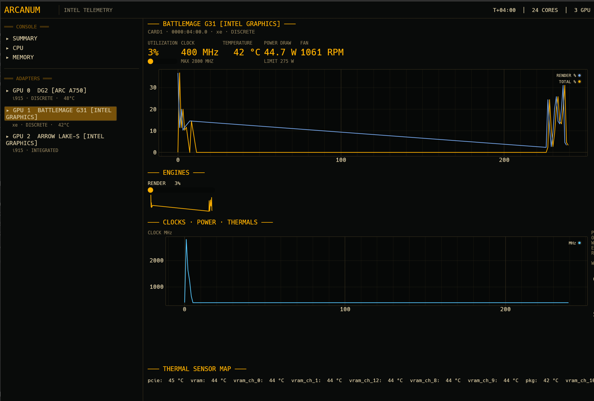

# Arcanum

A hardware dashboard for Intel graphics, dressed up like an amber CRT
stock terminal. CPU, memory and GPU stats: utilization, clocks,
temperatures, power draw, fan speeds, all in one native window.



Intel GPUs only, meaning the `i915` and `xe` kernel drivers. NVIDIA and
AMD users already have plenty of good options. Intel users get nvtop
showing 0% on a Battlemage card that's pulling 230 watts, that's the
itch this project scratches.


```
arcanum                 # launch the dashboard
arcanum --once          # print one full sample (text)
arcanum --once --json   # one full sample as JSON (scripting / CI)
arcanum --interval 0.5  # poll every 0.5 s
```

## What it shows

| | |
|---|---|
| GPU | per-engine utilization (Render / Video / Copy / Compute), clock speed, package + VRAM + per-channel temperatures, power draw from on-die energy counters, power limit, fan RPM, VRAM in use, integrated vs discrete |
| CPU | total and per-core utilization, per-core clocks, base clock, package temperature, per-core temperatures, package power (RAPL) |
| Memory | used / available / cached / buffers, swap |

## Where the data comes from

Everything is read from standard kernel interfaces. No vendor SDKs, external tools, or root needed for the basics.

- `/proc/stat`, `/proc/meminfo`, cpufreq sysfs for CPU and memory
- `/sys/class/drm/card*/device/hwmon` for GPU temps, fans, power
  limits and energy counters
- `gt_*_freq_mhz` (i915) and `tile*/gt*/freq0/*` (xe) for clocks
- DRM fdinfo, meaning `/proc/*/fdinfo/*`, for per-engine utilization
  and memory. This is the same interface nvtop and intel_gpu_top use.
- hwdata pci.ids for card marketing names ("Battlemage G31" and so on)

## Supported hardware

- `i915`: Alchemist (Arc A-series) and integrated graphics on Arrow
  Lake, Alder Lake, Meteor Lake, Raptor Lake and friends
- `xe`: Battlemage (Arc B-series, Arc Pro B-series), Lunar Lake, and
  whatever Intel ships next on this driver

## Optional: xe utilization and CPU package power

Two data sources need extra capabilities. Without them arcanum still
runs, it just shows blanks where those numbers would be.

| Missing | Symptom | Fix |
|---|---|---|
| `CAP_PERFMON` | xe GPUs show 0% utilization and no VRAM | `sudo setcap cap_perfmon=ep <binary>` |
| `CAP_DAC_OVERRIDE` | "CPU package power: needs root" | `sudo setcap cap_dac_override=ep <binary>` |

After a release build, run `scripts/setup-permissions.sh` to grant
both. File capabilities survive reboots but not a rebuild, so re-run
the script after `cargo build --release`.

## Building

```bash
cargo build --release
./target/release/arcanum
```

Needs Rust 1.85 or newer. The GUI is
[egui](https://github.com/emilk/egui)

### AppImage

```bash
scripts/build-appimage.sh        # → dist/arcanum_<version>_x86_64.AppImage
```

### Install from source

```bash
cargo install --path .
```

## Project layout

```
src/
├── main.rs           CLI entry: GUI, --once, --json
├── app.rs            eframe app: theme, panels, history recording
├── history.rs        ring buffers behind every plot
├── collector/        ← all data acquisition lives here
│   ├── mod.rs        Snapshot type + background sampler thread
│   ├── gpu.rs        i915/xe cards: fdinfo, clocks, hwmon, energy→watts
│   ├── cpu.rs        /proc/stat, cpufreq, coretemp, RAPL
│   ├── memory.rs     /proc/meminfo
│   └── hwmon.rs      generic hwmon sysfs parsing
└── ui/               Summary / CPU / Memory / GPU pages + widgets
```

The collector doesn't know the UI exists. It does the rate math
itself (jiffies to percent, energy counters to watts) and pushes
`Snapshot` structs over a channel. The GUI, `--once`, and any other
frontend you write all just read that channel, so nothing here needs
to change when the frontend does.

## Roadmap

- [ ] xe total VRAM via `DRM_IOCTL_XE_DEVICE_QUERY`
- [ ] per-process GPU usage list (fdinfo client breakdown)
- [ ] zram/zswap stats
- [ ] thermal throttling indicators (`freq0/throttle` on xe)
- [ ] Wayland fractional scaling polish

## Contributing

Bug reports and PRs welcome. Especially useful: anyone with Lunar
Lake or Panther Lake hardware, or older Alchemist boards, since the
collector currently gets tested on Battlemage + Alchemist + Arrow
Lake and nothing else.

## License

MIT, see [LICENSE](LICENSE).
